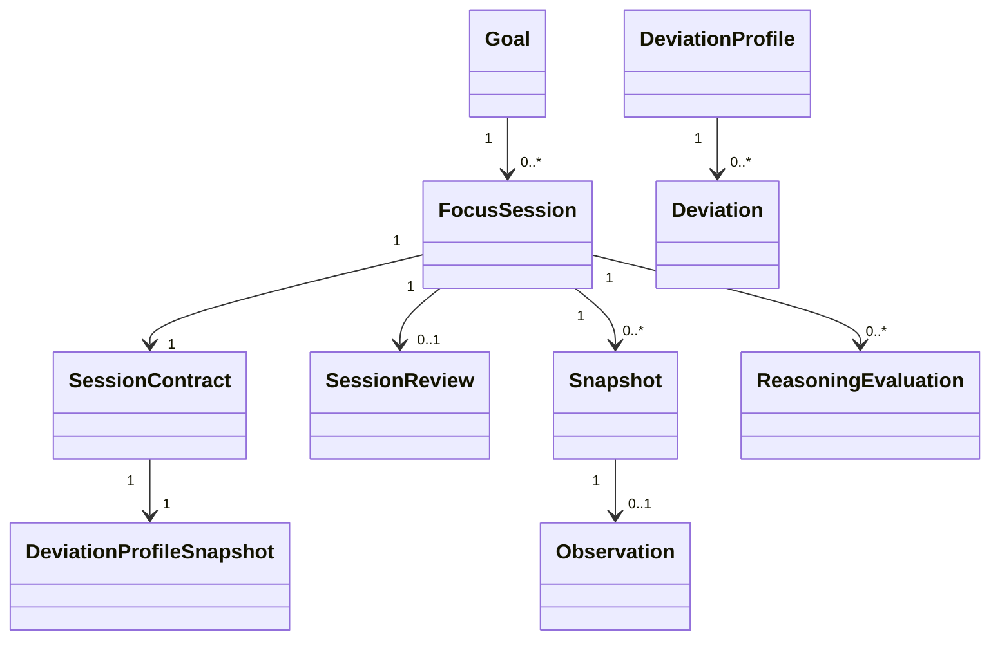
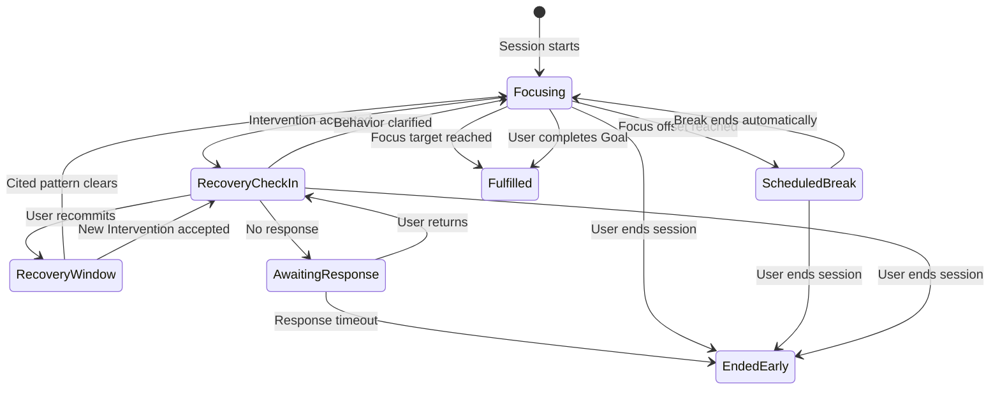

# AI Accountability Application Logic

## Status

This document records the shared product and behavior model agreed before implementation. It is technology-independent. No framework, model provider, database, or prompt design is selected here.

The product's central objective is:

> Intervene only when accumulated evidence suggests an intervention would be more helpful than disruptive.

Helping the user return to focused behavior is the product aspiration. The system does not claim to control user behavior, verify task completion visually, or optimize a person directly.

## Core scope

Version one assumes:

- One local user with no account or authentication.
- One active Focus Session at a time.
- One fixed webcam connected to the controller machine.
- Periodic still images rather than video processing.
- No screen recording, operating-system activity, keyboard tracking, or continuous microphone monitoring.
- Local authoritative state and retained session data.
- Hosted LLM services may process images, structured observations, and Recovery Check-in conversation turns.

## Domain relationships



### Goal

A Goal is the persistent to-do-list item. It contains:

- A required title
- An optional description
- Active or completed status
- Creation and completion timestamps

A Goal may have many Focus Sessions. Deleting a Goal requires explicit confirmation and deletes its Focus Sessions and all session-owned data. A Goal with an active Focus Session cannot be edited or deleted until monitoring ends.

### Focus Session

A Focus Session is one monitored attempt to work toward a Goal. It links to its Goal and owns one immutable Session Contract. A short-term Goal may have one Focus Session; a longer Goal may accumulate many.

### Session Contract

The contract contains:

- A snapshot of the Goal title and description
- Target active-focus duration
- Zero or more fixed Scheduled Breaks
- An immutable snapshot of the current Deviation Profile
- Reasoning mode: Profile Only or Exploratory
- Qualitative sensitivity: Strict, Balanced, or Relaxed

The contract is editable during setup and immutable after monitoring begins. A repeat session is prefilled from the Goal's most recent contract but must be reviewed and confirmed as a new snapshot.

Goal modes, predeclared exceptions, Focus Agreements, fixed negative-constraint catalogs, and free-text self-commitments are not part of the core contract.

### Deviation Profile

The single local user creates one reusable Deviation Profile during guided onboarding. Suggested and custom natural-language Deviations are allowed. Suggested items may include:

- Sustained attention to a phone
- Leaving the camera view
- Another person remaining visible
- Appearing to rest or sleep
- Sustained attention to unrelated room activity

No suggested item is enabled without user confirmation. Each custom item receives a non-blocking assessment of whether it appears visually observable, partially observable, or not visually observable. The assessment informs the user but does not prevent experimentation.

Editing the reusable profile during an active session affects future sessions only. The active contract retains its original snapshot.

## Session setup and camera preflight

The core start flow is:

1. Create or select an active Goal.
2. Create a Session Contract, prefilled from the Goal's most recent contract when available.
3. Review the target duration, Scheduled Breaks, Deviation Profile snapshot, reasoning mode, and sensitivity.
4. Confirm the immutable contract.
5. Complete camera preflight.
6. Start monitoring.

Camera preflight is mandatory. The webcam must be available, a usable setup snapshot must be captured, exactly one user must be visible, and the user must confirm that the camera view is correct. There is no designated-work-area region in the core version; visibility means remaining somewhere in the fixed camera view.

## Reasoning modes

### Profile Only

Profile Only is the default. Every Intervention must identify a Deviation in the contract's profile snapshot.

### Exploratory

Exploratory mode may propose an Intervention for unlisted behavior that appears inconsistent with the Goal. The Intervention must disclose that the behavior is unlisted and ground the judgment in cited observations. Exploratory findings remain session history and are not offered for automatic or one-click promotion into the reusable profile.

### Sensitivity

Strict, Balanced, and Relaxed are qualitative reasoning instructions. For the prototype, the controller imposes no minimum evidence duration. The Reasoning Agent may propose an Intervention after one observation if it considers that justified. This deliberately accepts possible overreaction so the behavior can be tested.

## Component responsibilities

| Component | Owns | Does not own |
|---|---|---|
| Local controller | Authoritative state, timing, scheduling, persistence, validation, orchestration, and tool execution | Semantic judgments about visible behavior |
| Perception Agent | Neutral visible facts and cues from one snapshot | Goal consistency, Deviation matches, or Intervention decisions |
| Reasoning Agent | Temporal interpretation, Evidence Episodes, Deviation matches, and bounded decision proposals | Authoritative timestamps, direct state mutation, or tool execution |
| Recovery LLM | Natural voice interaction and mapping speech to bounded outcome proposals | Raw-image interpretation, contract mutation, or tool execution |

Session mechanics are deterministic. Perception, behavioral judgment, and natural-language interpretation are nondeterministic. Agents only return structured proposals; the controller validates and executes them.

## Observation pipeline

1. The local controller captures a snapshot at the application-level target cadence.
2. The raw snapshot is retained locally.
3. The controller sends the image bytes directly to the hosted Perception Agent over an authenticated secure connection.
4. Perception returns a neutral observation.
5. Each successful observation triggers one ordered Reasoning Agent evaluation in the core version.
6. Reasoning returns an evidence-linked structured proposal.
7. The controller validates and applies the proposal if it is valid for the current session version and state.

The Perception Agent remains blind to the Goal, Deviation Profile, sensitivity, session history, and Intervention state. Targeted or profile-aware perception is deferred until observability problems are demonstrated.

### Latest-frame policy

The core version permits only one active end-to-end Perception-plus-Reasoning cycle. If new frames arrive before that cycle finishes, only the newest unprocessed frame waits for the next cycle. Captured frames are still retained; skipped frames are marked unprocessed rather than treated as indeterminate behavioral evidence.

Every result records controller-owned capture and processing times. Results older than a configurable freshness limit remain available for audit but cannot support live Intervention. Sustained stale output follows the technical-outage policy.

Separately configurable perception and reasoning cadences are deferred. The core pipeline evaluates each accepted perception result once.

## Observation shape

Perception uses a hybrid fixed-plus-open-ended structure. It includes stable scene data and a bounded list of neutral visible cues. An illustrative shape is:

```json
{
  "image_quality": {
    "value": "adequate",
    "limitations": []
  },
  "people_count": 1,
  "objects": ["phone", "laptop", "notebook"],
  "observations": [
    {
      "subject": "visible_person",
      "behavior": "looking_toward_phone",
      "support": "partial",
      "visual_basis": "Head and phone are oriented toward each other.",
      "limitations": ["Hands are partly occluded."]
    }
  ]
}
```

Visual support is described as `direct`, `partial`, `inferred`, or `unavailable`; it is not presented as a calibrated probability. `Not visible`, `not occurring`, and `unknown` are distinct states. Image-quality problems and occlusion create uncertainty, not negative behavioral evidence.

The system assumes a single-person scene and performs no identity or face recognition. If several people appear, monitored-user identity may be indeterminate even though the presence of another person can itself be an observable fact.

## Durable reasoning state

The LLM context window is not the memory system. The controller persists:

- Active and historical Evidence Episodes
- Recent observations
- Deviation Overrides
- Recovery Check-in history and outcomes
- Consecutive unsuccessful recoveries
- Current Recovery Window
- Compact prior-decision summaries
- Every Reasoning Evaluation, including `continue_observing`

Each Reasoning Agent request receives the immutable contract, relevant durable state, new observation, and a bounded recent window. Older information is compacted into episode summaries.

### Decision grounding

An Intervention proposal identifies:

- A profile Deviation identifier, or `unlisted` in Exploratory mode
- The first and latest observations in the Evidence Episode
- A small set of key supporting observations
- Important contradictory or indeterminate observations
- A concise rationale
- One bounded proposed action

Short session-local observation identifiers are sufficient. The controller derives authoritative timestamps and disputed duration from stored observations and can reconstruct the complete interval.

## Focus Timer rules

- The Focus Timer measures active committed time, not fixed wall-clock duration.
- Scheduled Breaks pause it automatically.
- Suspected behavior does not permanently change it until an Intervention is accepted by the controller and resolved through the Recovery Check-in.
- An Intervention provisionally pauses time from the first observation in its cited Evidence Episode.
- Recommitment confirms exclusion of the disputed interval. Resuming is explicit approval to move the projected session end.
- A Behavior Clarification restores the disputed interval.
- The agent never changes the projected end without a user action that supplies approval.

## Scheduled Breaks

Scheduled Breaks are optional and fixed in the Session Contract. Each has an active-focus offset and duration.

- The break begins automatically when its focus-time offset is reached.
- The Focus Timer pauses and a break timer begins.
- Observations during the break cannot accumulate Deviation evidence.
- The break ends automatically and the Focus Timer resumes.
- Behavior after the break is evaluated normally.

There are no ad hoc breaks and no general Pause Monitoring control. A user who cannot continue outside a Scheduled Break ends the Focus Session early.

## Intervention and Recovery Check-in

Every Recovery Check-in begins with an uncertainty-aware explanation containing:

- The suspected listed or exploratory Deviation
- Approximate observed duration
- A concise evidence summary
- Why the behavior may conflict with the session

The timer remains paused throughout the check-in. The microphone activates with an audible cue only for the check-in and deactivates when the interaction resolves or times out. The Recovery LLM receives the Goal, contract, approved Intervention context, disputed interval, applicable Deviation Overrides, and allowed outcomes. It never receives room snapshots.

The user speaks naturally; there are no keywords or command phrases. The Recovery LLM maps speech to one of these proposals:

- Recommit and resume
- Behavior clarified as goal-consistent
- End the Focus Session early
- Request additional bounded coaching
- Unclear response requiring brief clarification
- No response

Additional coaching has an application-configurable turn limit with a default of three exchanges. It must eventually resolve to recommitment, clarification, early ending, or no response.

### Behavior Clarification and Deviation Override

A Behavior Clarification restores disputed time and clears the current Evidence Episode. An explanation is not automatically a remainder-of-session rule. A Deviation Override for the rest of the session requires explicit contextual confirmation and never modifies the immutable contract or reusable profile.

### Recovery Window and escalation

Recommitment starts a configurable Recovery Window. Observations continue, but a second voice interaction cannot begin immediately. Recovery means the cited pattern has clearly ceased for a sustained period; it does not claim that task progress was visually verified.

Repeated unsuccessful recoveries are capped at a configurable count. The final escalation asks the user to recommit and continue or end early. Explicit continuation resets the cycle; the system never enters an endless reminder loop. The exact cap is a tuning value; the separately agreed additional-coaching turn limit defaults to three.

### No response

Silence enters Awaiting Response while the Focus Timer remains paused. A user returning before the configured timeout can continue the check-in. Expiration ends the Focus Session early with a no-response reason.

## Session lifecycle



`Fulfilled` and `Ended Early` are final session outcomes. The optional Session Review occurs after the Focus Session has ended.

## Completion and Session Review

A Focus Session is Fulfilled when its target active-focus duration is reached or the user explicitly declares the associated Goal complete. Goal completion during focus uses a confirmed interface action, marks the Goal complete, ends the Focus Session as Fulfilled, and opens the review.

The lightweight Session Review is shown after every Fulfilled or Ended Early outcome and remains optional. It records:

- Whether the user made meaningful progress
- Overall Intervention helpfulness: helpful, mixed, unhelpful, or not applicable
- An optional note
- Whether the Goal should be marked complete

It is a deterministic form, not an LLM conversation.

## Persistence, privacy, and deletion

- Raw snapshots, observations, reasoning state, decisions, contract snapshots, transcripts, and reviews are retained locally.
- Retention lasts until manual deletion in the core version.
- The application should track storage use, but automatic retention policies are deferred.
- Raw Recovery Check-in audio is discarded after processing; transcripts and structured outcomes are retained.
- Deleting a Focus Session deletes all data owned by that session while preserving the Goal.
- Deleting a Goal requires confirmation and deletes every associated Focus Session and all session-owned data.
- No application-managed remote image archive exists in the core version.

The local controller sends each selected snapshot directly to the hosted Perception Agent for inference. Provider-side data handling must be evaluated when a provider is chosen.

## Failure policy

Camera failures, image-capture failures, stale inference, network errors, and invalid agent responses are technical events, never behavioral evidence.

Agent responses are validated against bounded schemas. One automatic repair or retry is allowed. A second invalid response becomes an agent failure. Isolated failures create indeterminate or invalid observations. Sustained failures beyond a configurable technical grace period provisionally pause the Focus Timer from the first failed capture and ask the user to restore monitoring or end early. An unresolved outage eventually ends the session early.

Automatic crash and restart recovery is deferred.

## Core invariants

1. Only the controller changes authoritative state or invokes tools.
2. Agents return bounded structured proposals.
3. Perception describes visible facts and does not judge Deviation or Goal consistency.
4. Reasoning decisions are grounded in reconstructable observation references.
5. Uncertainty and technical failure never become negative behavioral evidence by themselves.
6. The Session Contract does not change after monitoring begins.
7. The agent never extends projected session time without explicit user approval.
8. The system never claims to verify actual task completion from room images.
9. The microphone is not continuously active.
10. Repeated interventions are bounded.

## Deferred work

- Cross-session habit analysis and user-approved personalization
- Automatic contract or Deviation Profile suggestions
- Long-term storage management and automatic retention
- Independent perception and reasoning cadences
- Profile-aware or targeted perception for custom observability
- Developer replay and model-comparison tooling
- Crash and restart recovery
- Post-implementation intervention-quality evaluation
- Multiple users, accounts, remote control, multiple cameras, and concurrent sessions

## Implementation choices intentionally unresolved

- User-interface and application framework
- LLM and speech providers
- Local persistence engine
- Exact structured-output schemas and prompts
- Snapshot compression and transport details
- Default cadence, freshness limit, Recovery Window, response timeout, and technical grace values
- Security controls required by the selected hosted providers

These choices should be made during architecture and implementation planning without changing the product logic above.
