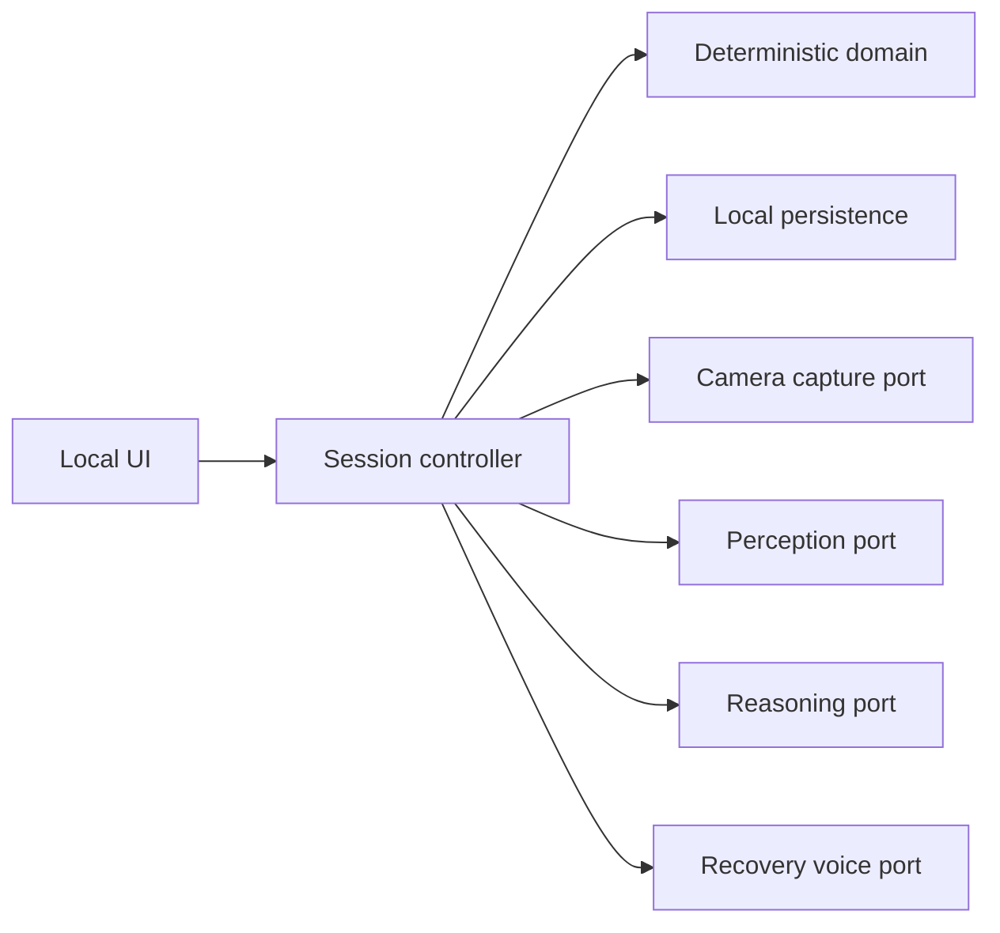

# GoalKeeper Implementation Plan

## Purpose

This plan turns [application-logic.md](./application-logic.md) into an implementation sequence while accounting for the existing `capture.py` prototype. It does not require the full application to use Python.

The implementation should remain a modular local application. Deterministic session mechanics own authoritative state; hosted agents provide bounded, validated proposals.

## What already exists

`capture.py` is a working vertical prototype that currently combines two responsibilities:

1. **Camera adapter and capture service**: webcam lifecycle, preflight UI, fixed cadence, JPEG encoding, local retention, and latest-frame buffering.
2. **Perception Agent adapter**: direct OpenAI image requests, a neutral prompt, structured observation schema, and observation logging.

Existing coverage includes 18 unit/integration-style tests for schema construction, preflight, latest-frame replacement, API failure handling, fixed scheduling, camera cleanup, and capture under slow inference.

The tests could not run in the current execution environment because OpenCV is not installed there. This is an environment issue, not a discovered test failure.

### Reuse assessment

| Capability | Current status | Planned treatment |
|---|---|---|
| Webcam open, warmup, capture, release | Implemented | Preserve behind a Camera port or port behavior to the selected stack |
| Mandatory preflight | Implemented | Preserve; move provider-specific validation behind Perception port |
| Local JPEG retention | Implemented | Preserve; route paths and metadata through session storage |
| Fixed-grid capture cadence | Implemented | Preserve; drive it from application settings |
| Latest-frame buffering | Implemented | Preserve and later extend across the complete Perception-plus-Reasoning cycle |
| Neutral Perception prompt and schema | Implemented | Preserve as the first versioned Perception contract |
| Direct hosted-model request | Implemented | Extract behind provider-neutral Perception port |
| JSONL observation/event logs | Prototype storage | Retain for diagnostics if useful; authoritative data moves to local persistence |
| Wall-clock CLI duration | Implemented for smoke tests | Do not treat as the domain Focus Timer |
| Reasoning, session controller, voice, Goals, and reviews | Not implemented | Build in the phases below |

## Stack decision

Do not choose the full application stack solely because the first spike is Python. Make one explicit decision before expanding the codebase:

- **Single Python application:** refactor `capture.py` into internal adapters.
- **Another single-runtime application:** use the current code and tests as a behavioral specification, then port the capture and Perception adapters.
- **Non-Python application with a Python worker:** expose the existing slice through a narrow local process boundary. Choose this only if preserving the spike saves more time than operating two runtimes costs.

The recommended default is one application runtime. A Python worker is a pragmatic fallback for prototype speed, not the preferred permanent boundary.

## Target architecture

Use these logical modules regardless of language:

- **Domain:** entities, value objects, Focus Timer, FSM, invariants
- **Application:** commands, queries, controller orchestration
- **Ports:** clock, camera, storage, persistence, Perception, Reasoning, Recovery, microphone, speech output
- **Adapters:** webcam, local database/files, hosted agents, audio, UI

### Non-negotiable rules

1. Only the controller changes authoritative session state or invokes tools.
2. Domain code does not import camera, UI, database, HTTP, model SDK, or audio libraries.
3. Agent responses are validated and versioned before use.
4. Every external dependency has a deterministic fake for automated tests.
5. Live durations use an injected monotonic clock; audit records use UTC timestamps.
6. Session-version checks reject stale asynchronous results.
7. Credentials, base64 images, and raw microphone buffers never enter logs.
8. Provider, model, prompt version, schema version, latency, and request ID are stored with agent evaluations.

## Phase 0: Baseline and architecture decisions

### Work

- Create an isolated environment for the existing prototype and install its declared dependencies.
- Run the 18 existing tests and record a clean baseline before refactoring.
- Perform one consented manual webcam preflight and one image-only provider smoke test.
- Verify that the configured model name supports the required image and structured-output behavior.
- Choose the full application language/runtime and local UI shell.
- Decide whether `capture.py` is retained, ported, or isolated as a temporary worker.
- Choose the local database and migration mechanism. Relational metadata plus filesystem snapshot storage is recommended.
- Choose the Reasoning and voice providers.
- Add project-wide formatting, static analysis, tests, and CI without hardware or network calls.
- Define the local application-data and secrets locations.

### Exit criteria

- Existing capture behavior has a reproducible test baseline.
- The runtime, UI, persistence, provider, and capture-reuse decisions are recorded.
- A fresh checkout can run automated tests without a webcam or provider credentials.

## Phase 1: Deterministic domain kernel

Build this independently from `capture.py`.

### Types

- Goal and Goal status
- Deviation Profile and Deviation
- Focus Session and Session Contract
- Scheduled Break and Focus Timer
- Observation reference and Evidence Episode
- Reasoning Evaluation and Intervention
- Behavior Clarification and Deviation Override
- Recovery Window and Session Review

### Session states

- Focusing
- Scheduled Break
- Recovery Check-in
- Recovery Window
- Awaiting Response
- Monitoring Unavailable
- Fulfilled
- Ended Early

### Commands and transitions

- Confirm immutable Session Contract
- Start after successful preflight
- Begin and end Scheduled Break automatically
- Reach target active-focus duration
- Complete Goal early
- Admit a validated Intervention proposal
- Provisionally dispute an evidence interval
- Restore time after Behavior Clarification
- Confirm excluded time and resume
- Enter and leave Recovery Window
- Apply remainder-of-session Deviation Override
- Escalate repeated unsuccessful recoveries within a configured cap
- End on no response, unrecovered technical failure, or user request

### Tests

- Table-driven valid and invalid FSM transitions
- Fake-clock Focus Timer and Scheduled Break tests
- Contract immutability
- Projected end changes only after user approval
- Goal completion as fulfillment
- Recovery cap, reset, and timeout behavior
- Active-Goal edit/delete lock

### Exit criteria

The entire lifecycle runs in memory using a fake clock with no camera, persistence, network, or LLM.

## Phase 2: Persistence and setup workflow

### Recommended records

- Goals
- Reusable Deviation Profile and Deviations
- Focus Sessions
- Immutable Session Contract snapshots
- Snapshots and processing status
- Observations
- Reasoning Evaluations and Evidence Episodes
- Interventions and Recovery turns
- Deviation Overrides
- Session Reviews
- State-transition audit events
- Application settings

Use normalized fields for queryable identity, state, and timing. Store versioned agent documents as JSON attached to their normalized record. Do not adopt full event sourcing.

### Work

- Add database migrations and repositories.
- Create Goal and Deviation Profile setup.
- Support Profile Only and Exploratory modes and qualitative sensitivity.
- Build Session Contract setup with duration and fixed Scheduled Breaks.
- Prefill from the Goal's latest contract and lock a new immutable snapshot at start.
- Implement confirmed session and Goal cascade deletion across metadata and image files.
- Add optimistic session versions for asynchronous work.
- Track session and total snapshot storage usage.

### Exit criteria

A user can create a Goal and profile, confirm a contract, and persist a ready session. Historical contracts do not change when current Goal or profile data changes.

## Phase 3: Extract and integrate capture and Perception

Preserve the existing vertical behavior while separating its boundaries.

### Camera capture boundary

Extract or port:

- Webcam discovery/open/warmup/release
- Frame capture and JPEG encoding
- Fixed-grid scheduling without burst catch-up
- Preflight frame acquisition and user confirmation
- Local snapshot retention
- One-slot newest-frame buffer
- Camera health and technical events

The Camera adapter must know nothing about OpenAI, Goals, Deviations, or session reasoning.

### Perception boundary

Extract or port:

- Neutral system prompt
- Versioned hybrid observation schema
- Direct snapshot upload
- Structured-output validation
- One application-level schema repair retry
- Safe provider metadata and latency capture

The Perception adapter must not receive Goal, Deviation Profile, sensitivity, history, or Intervention state.

### Gaps to add

- Controller-owned observation IDs, UTC capture time, processed time, and schema version
- Freshness-limit enforcement
- Explicit `captured`, `superseded`, `observed`, `stale`, and `agent_error` processing states
- One active end-to-end Perception-plus-Reasoning cycle rather than a Perception-only worker
- Persistence through repositories instead of JSONL as the authority
- Technical-grace aggregation for repeated camera or agent failure

### Tests

- Preserve all existing capture tests or equivalent ported behavior tests.
- Add adapter contract tests with recorded provider responses.
- Prove Goal and Deviation content never enters Perception input.
- Prove stale, invalid, and failed observations cannot become behavioral evidence.
- Prove camera release on every session exit and failure path.

### Exit criteria

The controller can pass mandatory preflight, retain periodic snapshots, and receive validated neutral Observations through provider-neutral ports.

## Phase 4: Reasoning Agent and durable memory

### Input

Send only:

- Goal and immutable contract snapshots
- Profile Only or Exploratory mode
- Qualitative sensitivity
- Deviation Overrides
- Active Evidence Episode summaries
- Intervention and Recovery summaries
- New Observation and a small recent window

Do not send raw room images or the entire session history.

### Output

Require:

- `continue_observing` or `begin_recovery_check_in`
- Listed Deviation ID, or `unlisted` only in Exploratory mode
- Evidence start, latest, and a few key observation references
- Contradictory or indeterminate references
- Concise rationale
- Proposed Evidence Episode updates

### Validation

Reject missing, cross-session, out-of-order, stale, or nonexistent references; unlisted Profile Only Deviations; stale session versions; and actions invalid for the current FSM state.

The prototype has no controller-enforced minimum evidence duration.

### Work

- Build compact durable Evidence Episode state.
- Bound the recent context window and compact older history.
- Version prompt and output schemas.
- Persist every evaluation, including non-interventions.
- Implement one validation/repair retry.
- Add a scripted deterministic Reasoning fake.

### Exit criteria

Every proposed Intervention is reconstructable from persisted observations, and long sessions keep bounded model context.

## Phase 5: End-to-end controller with scripted Recovery

Integrate the domain, persistence, capture, Perception, and Reasoning before adding voice.

### Work

- Run one active Perception-plus-Reasoning cycle with newest-frame coalescing.
- Apply freshness and session-version checks at every asynchronous boundary.
- Provisionally pause from the Reasoning Agent's cited evidence start.
- Use a temporary text/script Recovery adapter.
- Implement Behavior Clarification, recommitment, Deviation Override, Recovery Window, no-response, and escalation outcomes.
- Suppress Deviation evidence during Scheduled Breaks.
- Treat repeated camera and agent failures as technical monitoring outages.
- Enforce one live Focus Session.

### Required scenario tests

1. Uninterrupted session reaches fulfillment.
2. Scheduled Break begins and ends at exact active-focus offsets.
3. Profile Only rejects an unlisted Intervention proposal.
4. Exploratory mode accepts a grounded unlisted proposal.
5. Behavior Clarification restores the disputed interval.
6. Recommitment excludes disputed time and approves the shifted end.
7. Recovery Window prevents immediate repeated conversation.
8. Repeated unsuccessful recovery reaches bounded escalation.
9. No response ends early after timeout.
10. Goal completion fulfills before target duration.
11. Stale or invalid agent output is recorded but ignored.
12. Technical failure never becomes Deviation evidence.
13. Session and Goal deletion remove all owned artifacts.

### Exit criteria

The complete product logic passes with fake agents, fake camera, and fake clock without network or hardware.

## Phase 6: Natural voice Recovery Check-in

### Work

- Activate the microphone only in Recovery Check-in and play an audible cue.
- Begin with deviation, duration, evidence, and uncertainty-aware justification.
- Accept natural speech rather than keywords.
- Map speech into recommit, Behavior Clarification, end early, additional coaching, unclear, or no response.
- Keep the Focus Timer paused throughout conversation.
- Enforce the configurable additional-coaching limit, default three.
- Release the microphone on every exit and timeout.
- Retain transcript and structured outcome; discard raw audio.
- Preserve a text Recovery adapter for automated tests and development fallback.

### Exit criteria

A live Intervention completes a bounded natural-language Recovery Check-in and always resolves to a valid controller outcome or timeout.

## Phase 7: Completion, review, history, and deletion UI

### Work

- Display Goal list, live state, Focus Timer, Scheduled Break state, and projected end.
- Add confirmed Complete Goal and End Early controls.
- Show the optional lightweight Session Review after Fulfilled and Ended Early outcomes.
- Capture progress, intervention helpfulness, optional note, and Goal completion.
- Display Goal session history and local storage usage.
- Implement confirmed session and Goal deletion.
- Do not add habit analysis, profile learning, or automatic retention.

### Exit criteria

The complete core user flow is usable through the selected local UI, and skipping a review never blocks returning to the Goal list.

## Phase 8: Hardening and prototype readiness

### Failure exercises

- Disconnect webcam during every active state.
- Simulate model timeout, invalid schema, rate limit, and network loss.
- Force Perception and Reasoning beyond the freshness limit.
- End a session from every nonterminal state.
- Run a long session to expose context growth, thread/task leaks, or camera cleanup failures.
- Verify secrets, image bodies, and audio buffers never appear in logs.

### Configuration to tune

- Snapshot cadence
- Observation freshness limit
- Recovery Window
- No-response timeout
- Technical grace period
- Repeated-Recovery cap
- Additional-coaching limit
- Sensitivity prompt language
- JPEG dimensions, quality, and detail level
- Recent-observation and episode-compaction limits

### Core definition of done

- Goal, Deviation Profile, and immutable Session Contract setup works.
- Mandatory preflight and local retained capture work.
- Perception produces neutral validated Observations.
- Reasoning produces durable evidence-linked evaluations.
- The controller safely executes the documented FSM and timer rules.
- Voice Recovery is bounded and natural-language based.
- Session completion, review, history, and cascade deletion work.
- Every external dependency has a fake.
- The scenario suite passes without network or hardware.

## Deferred

- Cross-session habit analysis and personalization
- Automatic profile or contract suggestions
- Separate Perception and Reasoning cadences
- Profile-aware or targeted Perception
- Automatic screenshot retention
- Crash/restart recovery
- Replay and model comparison
- Formal intervention-quality evaluation
- Accounts, multiple profiles, remote control, multiple cameras, or concurrent sessions

## Delivery order

1. Baseline and decide how the existing Python slice will be reused.
2. Implement the deterministic domain and FSM.
3. Add persistence, Goal/profile setup, and immutable contracts.
4. Extract or port capture and Perception behind separate ports.
5. Implement evidence-linked Reasoning and durable memory.
6. Integrate the controller using scripted Recovery outcomes.
7. Add live voice Recovery.
8. Complete UI, review, deletion, and hardening.

The highest-risk proof remains whether neutral Perception output gives the Reasoning Agent enough reliable temporal evidence to make useful, explainable decisions. The existing capture prototype is valuable because it brings that proof closer; it should not force the rest of the application into an unsuitable stack.
