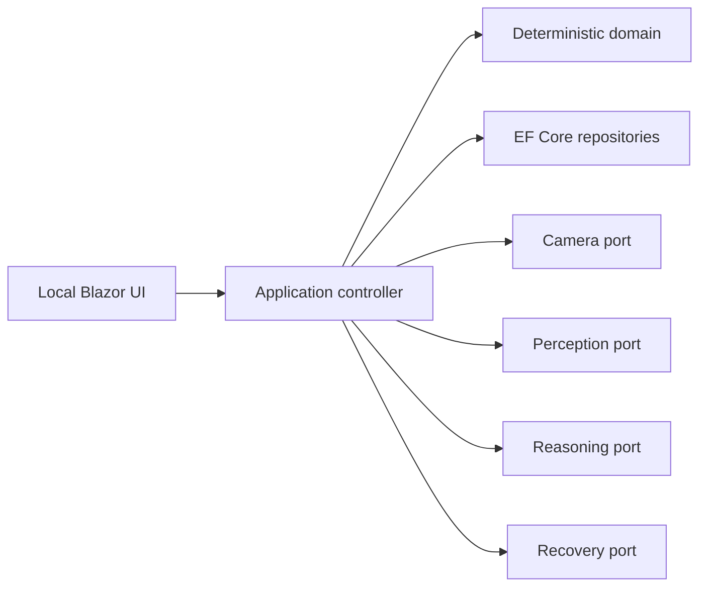
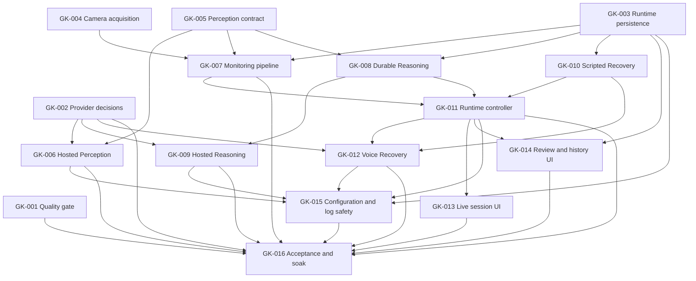

# GoalKeeper Implementation Plan

## Purpose

This document is the roadmap and dependency index. Executable remaining work is split into handoff-ready documents under [tasks](./tasks/README.md); individual task documents are the source of truth for scope, ownership, dependencies, and acceptance criteria.

Use the project documents in this order:

1. [CONTEXT.md](../CONTEXT.md) for canonical domain language.
2. [application-logic.md](./application-logic.md) for product behavior and invariants.
3. [ADR 0001](./adr/0001-dotnet-local-application-stack.md) for the selected stack.
4. [tasks/README.md](./tasks/README.md) for assignable work.

## Current baseline

The Phase 1 and 2 foundation and the first delivery wave are implemented in .NET 10:

- A framework-independent deterministic domain kernel owns the Focus Timer and documented Focus Session states, including validated runtime snapshot/rehydration and an exhaustive atomic command/state matrix.
- EF Core and SQLite persist setup and complete runtime state, enforce one active Focus Session globally, retain rejected evaluations separately, and expose bounded application-facing history/query contracts.
- Provider-neutral camera acquisition and Perception v1 contracts have deterministic hardware/network-free fakes and contract suites.
- Fixed-cadence monitoring retains auditable snapshots, applies newest-frame backpressure, persists only fresh validated Observations, and reports technical health without behavioral evidence.
- Durable Reasoning maintains bounded evidence-linked memory, records accepted and rejected evaluations, and provides deterministic scripts for controller scenarios.
- The scripted Recovery boundary validates every bounded Check-in outcome and persists complete turn metadata without provider, audio, or network dependencies.
- The interactive-server Blazor UI supports Goal, Deviation Profile, Session Contract, and ready Session Setup workflows.
- Hosted Perception, hosted Reasoning, the end-to-end runtime controller, natural voice, and live/review UI remain assigned work.
- The retained Python reference and current .NET foundation both have automated suites that run without hardware, provider credentials, or network calls.

## Target architecture

### Non-negotiable rules

1. Only the application controller changes authoritative session state or invokes external tools.
2. Domain code does not import camera, UI, database, HTTP, model SDK, or audio libraries.
3. Agent responses are schema-validated and session-version checked before use.
4. Every external dependency has a deterministic fake for automated tests.
5. Live durations use an injected monotonic clock; audit records use UTC timestamps.
6. Technical failure and uncertainty never become Deviation evidence.
7. Credentials, base64 images, and raw microphone buffers never enter logs.
8. Provider, model, prompt version, schema version, latency, and request ID are retained with evaluations.

## Remaining delivery graph

Tasks with no incoming edge can be assigned immediately. A dependent task may be explored early, but it must not integrate against an unstable dependency contract.

## Delivery waves

1. Run **GK-001** through **GK-005** in parallel; only GK-002 needs a human/provider decision.
2. Start **GK-006**, **GK-007**, **GK-008**, and **GK-010** as soon as their small contract dependencies merge.
3. Run **GK-009** while **GK-011** proves the full lifecycle with deterministic fakes.
4. After GK-011, run **GK-012**, **GK-013**, and **GK-014** in parallel, keeping shared host and web-shell files with their declared owners.
5. Complete **GK-015**, then finish with **GK-016** and the consented full-system exercises.

## Assignment and handoff

- One person or agent owns one task and one branch at a time.
- The assignee updates the task status before work and includes its ID in the branch and PR title.
- The task's **Owned surface** is the default write boundary. Changes outside it require coordination in the PR description.
- Dependencies are consumed through their published interfaces; do not silently redesign another task's contract.
- Every PR includes automated test evidence and notes any manual verification that remains.
- A task is complete only when every acceptance criterion in its document is satisfied.

## Deferred work

These are deliberately outside the assignable core roadmap:

- Cross-session habit analysis and personalization
- Automatic profile or Session Contract suggestions
- Separate Perception and Reasoning cadences
- Profile-aware or targeted Perception
- Automatic snapshot retention policies
- Crash/restart recovery
- Replay and model-comparison tooling
- Formal intervention-quality evaluation
- Accounts, multiple profiles, remote control, multiple cameras, or concurrent Focus Sessions

The highest-risk product proof remains whether neutral Perception output gives Reasoning enough reliable temporal evidence to make useful, explainable Intervention proposals. Tasks must preserve the separation between neutral observation and behavioral judgment while proving that boundary end to end.
