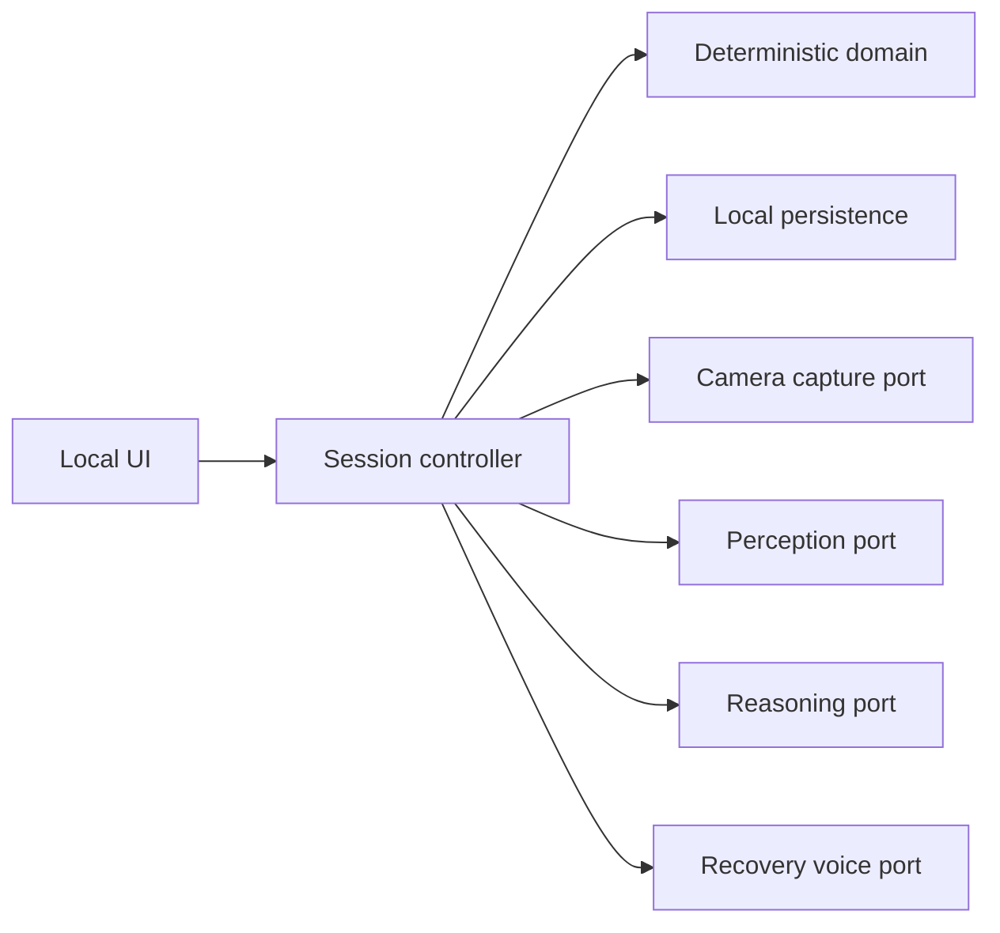

# GoalKeeper Implementation Plan

## Purpose

This plan turns [application-logic.md](./application-logic.md) into an implementation sequence while accounting for the existing `capture.py` prototype. It does not require the full application to use Python.

The implementation should remain a modular local application. Deterministic session mechanics own authoritative state; hosted agents provide bounded, validated proposals.

## What already exists

The working vertical prototype is now split across provider-neutral orchestration and adapters:

1. **`capture.py` application service**: preflight orchestration, fixed cadence, local retention, latest-frame buffering, and controller integration through Camera and Perception ports.
2. **`camera_adapter.py`**: OpenCV webcam lifecycle, preflight UI, and JPEG encoding.
3. **`perception.py`**: direct OpenAI image requests, a neutral prompt, and the structured observation schema.

Existing coverage includes 43 unit/integration-style tests: 20 capture, camera-adapter, and Perception tests plus 23 domain, SQLite, timer, controller, deletion, and Reasoning-boundary tests.

Baseline verified on 2026-07-16 with Python 3.11 after installing `requirements.txt`: all 43 tests pass without a webcam, provider credentials, hardware calls, or network calls.

Progress markers in this plan reflect the implementation review on 2026-07-16. Checked items are complete at the scope stated. Unchecked items with a **Partial** note have useful foundations but do not yet satisfy the complete plan item.

### Reuse assessment

| Capability | Current status | Planned treatment |
|---|---|---|
| Webcam open, warmup, capture, release | Implemented behind `CameraPort` | Preserve the OpenCV adapter behavior if the stack changes |
| Mandatory preflight | Implemented | Preserve; move provider-specific validation behind Perception port |
| Local JPEG retention | Implemented | Preserve; route paths and metadata through session storage |
| Fixed-grid capture cadence | Implemented | Preserve; drive it from application settings |
| Latest-frame buffering | Implemented | Preserve and later extend across the complete Perception-plus-Reasoning cycle |
| Neutral Perception prompt and schema | Implemented | Preserve as the first versioned Perception contract |
| Direct hosted-model request | Implemented behind `PerceptionPort` | Keep provider configuration inside the OpenAI adapter |
| JSONL observation/event logs | Prototype storage | Retain for diagnostics if useful; authoritative data moves to local persistence |
| Wall-clock CLI duration | Implemented for smoke tests | Do not treat as the domain Focus Timer |
| Goal, profile, and immutable contract model | Programmatic foundation implemented | Add the user-facing setup workflow and latest-contract prefill |
| SQLite authoritative storage | Goals, profiles, contracts, sessions, snapshots, observations, audit events, and confirmed cascade deletion implemented | Add migrations, remaining records, and storage accounting |
| Session controller and Focus Timer | Focusing, Scheduled Break, fulfillment, early ending, and Goal completion implemented | Complete Recovery, outage, and Intervention transitions |
| Reasoning boundary | Typed port, bounded recent observations, semantic/reference validation, atomic admission, and scripted test doubles implemented | Add durable evaluations, evidence episodes, freshness, and repair |
| Voice Recovery and reviews | Not implemented | Build in the phases below |

### Resolved review findings

- [x] Confirmed session and Goal deletion remove SQLite records and marker-owned session artifact directories while refusing unsafe unowned paths.
- [x] Reasoning staleness validation and proposal recording/admission execute under one controller lock.
- [x] Reasoning proposals are restricted to bounded actions and validate Deviation mode plus persisted, ordered, same-session evidence references before admission.
- [x] Automatic timer fulfillment clears its in-memory runtime entry.
- [x] Camera, preview, and Perception ports separate `capture.py` orchestration from the OpenCV and OpenAI adapters.

## Stack decision

Do not choose the full application stack solely because the first spike is Python. Make one explicit decision before expanding the codebase:

- **Single Python application:** refactor `capture.py` into internal adapters.
- **Another single-runtime application:** use the current code and tests as a behavioral specification, then port the capture and Perception adapters.
- **Non-Python application with a Python worker:** expose the existing slice through a narrow local process boundary. Choose this only if preserving the spike saves more time than operating two runtimes costs.

The recommended default is one application runtime. A Python worker is a pragmatic fallback for prototype speed, not the preferred permanent boundary.

## Target architecture

Use these logical modules regardless of language:

- **Domain:** entities, value objects, Focus Timer, FSM, invariants
- **Application:** commands, queries, controller orchestration
- **Ports:** clock, camera, storage, persistence, Perception, Reasoning, Recovery, microphone, speech output
- **Adapters:** webcam, local database/files, hosted agents, audio, UI

### Non-negotiable rules

1. Only the controller changes authoritative session state or invokes tools.
2. Domain code does not import camera, UI, database, HTTP, model SDK, or audio libraries.
3. Agent responses are validated and versioned before use.
4. Every external dependency has a deterministic fake for automated tests.
5. Live durations use an injected monotonic clock; audit records use UTC timestamps.
6. Session-version checks reject stale asynchronous results.
7. Credentials, base64 images, and raw microphone buffers never enter logs.
8. Provider, model, prompt version, schema version, latency, and request ID are stored with agent evaluations.

## Phase 0: Baseline and architecture decisions

### Work

- [ ] Create an isolated environment for the existing prototype and install its declared dependencies. **Partial:** the declared dependencies install successfully in the current environment.
- [x] Run the existing tests and record a clean baseline before refactoring. The current baseline is 43 passing tests: 20 capture/adapter tests and 23 controller tests.
- [ ] Perform one consented manual webcam preflight and one image-only provider smoke test.
- [ ] Verify that the configured model name supports the required image and structured-output behavior.
- [ ] Choose the full application language/runtime and local UI shell. **Partial:** the current implementation is a single Python runtime; the UI shell decision is not recorded.
- [x] Decide whether `capture.py` is retained, ported, or isolated as a temporary worker. It is currently retained and integrated into the single Python process.
- [ ] Choose the local database and migration mechanism. **Partial:** SQLite plus filesystem snapshots is implemented, but a migration mechanism is not.
- [ ] Choose the Reasoning and voice providers.
- [ ] Add project-wide formatting, static analysis, tests, and CI without hardware or network calls. **Partial:** the automated tests avoid hardware and network calls; formatting, static analysis, and CI are absent.
- [ ] Define the local application-data and secrets locations. **Partial:** capture output is configurable and the API key comes from the environment, but application-wide locations are not defined.

### Exit criteria

- [x] Existing capture behavior has a reproducible test baseline.
- [ ] The runtime, UI, persistence, provider, and capture-reuse decisions are recorded. **Partial:** the current runtime, persistence, and capture-reuse direction is evident; UI and provider decisions remain open.
- [x] A fresh checkout can run automated tests without a webcam or provider credentials after installing `requirements.txt`.

## Phase 1: Deterministic domain kernel

Build this independently from `capture.py`.

### Types

- [x] Goal and Goal status
- [x] Deviation Profile and Deviation
- [x] Focus Session and immutable Session Contract
- [x] Scheduled Break and deterministic active-focus timing
- [x] Snapshot and Observation reference
- [ ] Evidence Episode
- [ ] Durable Reasoning Evaluation and Intervention. **Partial:** typed Reasoning request/proposal types and a port exist.
- [ ] Behavior Clarification and Deviation Override
- [ ] Recovery Window and Session Review

### Session states

- [x] Focusing
- [x] Scheduled Break
- [ ] Recovery Check-in. **Partial:** validated Interventions enter the state atomically, but Recovery outcomes and timer reconciliation remain.
- [ ] Recovery Window. **Partial:** the enum value exists, but controller transitions do not.
- [ ] Awaiting Response. **Partial:** the enum value exists, but controller transitions do not.
- [ ] Monitoring Unavailable
- [x] Fulfilled
- [x] Ended Early

### Commands and transitions

- [x] Confirm immutable Session Contract
- [x] Start after successful preflight
- [x] Begin and end Scheduled Break automatically
- [x] Reach target active-focus duration
- [x] Complete Goal early
- [x] Admit a validated Intervention proposal through an atomic Focusing-to-Recovery-Check-in transition.
- [ ] Provisionally dispute an evidence interval
- [ ] Restore time after Behavior Clarification
- [ ] Confirm excluded time and resume
- [ ] Enter and leave Recovery Window
- [ ] Apply remainder-of-session Deviation Override
- [ ] Escalate repeated unsuccessful recoveries within a configured cap
- [ ] End on no response, unrecovered technical failure, or user request. **Partial:** user-requested early ending is implemented.

### Tests

- [ ] Table-driven valid and invalid FSM transitions. **Partial:** focused transition examples exist, but not a complete FSM table.
- [x] Fake-clock Focus Timer and Scheduled Break tests
- [x] Contract immutability
- [ ] Projected end changes only after user approval
- [x] Goal completion as fulfillment
- [ ] Recovery cap, reset, and timeout behavior
- [x] Active-Goal edit/delete lock

### Exit criteria

- [ ] The entire lifecycle runs in memory using a fake clock with no camera, persistence, network, or LLM. **Partial:** focusing, breaks, fulfillment, Goal completion, and early ending run deterministically, but the current controller requires SQLite and the Recovery lifecycle is absent.

## Phase 2: Persistence and setup workflow

### Recommended records

- Goals
- Reusable Deviation Profile and Deviations
- Focus Sessions
- Immutable Session Contract snapshots
- Snapshots and processing status
- Observations
- Reasoning Evaluations and Evidence Episodes
- Interventions and Recovery turns
- Deviation Overrides
- Session Reviews
- State-transition audit events
- Application settings

Use normalized fields for queryable identity, state, and timing. Store versioned agent documents as JSON attached to their normalized record. Do not adopt full event sourcing.

### Work

- [ ] Add database migrations and repositories. **Partial:** a versioned SQLite schema and repository exist, but forward migrations do not.
- [ ] Create Goal and Deviation Profile setup. **Partial:** controller and repository APIs exist; a user-facing setup workflow does not.
- [x] Support Profile Only and Exploratory modes and qualitative sensitivity in contract models and persistence.
- [x] Build programmatic Session Contract setup with duration and fixed Scheduled Breaks.
- [ ] Prefill from the Goal's latest contract and lock a new immutable snapshot at start. **Partial:** immutable contract/profile snapshots are implemented; latest-contract prefill is not.
- [x] Implement confirmed session and Goal cascade deletion across metadata and marker-owned image files.
- [x] Add optimistic session versions for asynchronous work.
- [ ] Track session and total snapshot storage usage.

### Exit criteria

- [ ] A user can create a Goal and profile, confirm a contract, and persist a ready session. Historical contracts do not change when current Goal or profile data changes. **Partial:** the programmatic model preserves historical snapshots, but there is no user-facing workflow or persisted pre-start session.

## Phase 3: Extract and integrate capture and Perception

Preserve the existing vertical behavior while separating its boundaries.

### Camera capture boundary

Extract or port:

- [x] Webcam open/warmup/release
- [x] Frame capture and JPEG encoding
- [x] Fixed-grid scheduling without burst catch-up
- [x] Preflight frame acquisition and user confirmation
- [x] Local snapshot retention
- [x] One-slot newest-frame buffer
- [ ] Camera health and technical events. **Partial:** read and API failures are logged, but technical-grace/outage state is not implemented.

- [x] The Camera adapter knows nothing about OpenAI, Goals, Deviations, or session reasoning; orchestration depends on provider-neutral ports.

### Perception boundary

Extract or port:

- [x] Neutral system prompt
- [ ] Versioned hybrid observation schema. **Partial:** a strict hybrid JSON schema exists but has no application schema version.
- [x] Direct snapshot upload
- [x] Provider-requested strict structured output and JSON decoding
- [ ] Local structured-output validation and one application-level schema repair retry
- [ ] Safe provider metadata and latency capture

- [x] The current Perception call receives only the neutral prompt, snapshot, model, and image-detail setting; Goal, profile, sensitivity, history, and Intervention state do not enter it.

### Gaps to add

- [ ] Controller-owned observation IDs, UTC capture time, processed time, and schema version. **Partial:** IDs and timezone-aware capture/processed times exist; schema version does not.
- [ ] Freshness-limit enforcement
- [ ] Explicit `captured`, `superseded`, `observed`, `stale`, and `agent_error` processing states. **Partial:** `captured`, `superseded`, and `observed` exist; failures use `api_error`, and `stale` is absent.
- [x] One active end-to-end Perception-plus-Reasoning cycle rather than a Perception-only worker
- [x] Persistence through repositories instead of JSONL as the authority when the controller integration is used
- [ ] Technical-grace aggregation for repeated camera or agent failure

### Tests

- [x] Preserve all 18 existing capture tests or equivalent ported behavior tests.
- [ ] Add adapter contract tests with recorded provider responses.
- [ ] Prove Goal and Deviation content never enters Perception input. **Partial:** the current method signature and prompt enforce separation, but there is no explicit leak-prevention test.
- [ ] Prove stale, invalid, and failed observations cannot become behavioral evidence. **Partial:** failed observations and stale session versions are excluded; local schema validation and durable behavioral evidence do not exist yet.
- [ ] Prove camera release on every session exit and failure path. **Partial:** cancellation, preflight error, normal shutdown, and slow-provider cleanup are tested, but not every future controller exit/failure path.

### Exit criteria

- [ ] The controller can pass mandatory preflight, retain periodic snapshots, and receive validated neutral Observations through provider-neutral ports. **Partial:** Camera and Perception ports are extracted and the integrated path works, but local schema validation is absent.

## Phase 4: Reasoning Agent and durable memory

### Input

Send only:

- Goal and immutable contract snapshots
- Profile Only or Exploratory mode
- Qualitative sensitivity
- Deviation Overrides
- Active Evidence Episode summaries
- Intervention and Recovery summaries
- New Observation and a small recent window

Do not send raw room images or the entire session history.

### Output

Require:

- `continue_observing` or `begin_recovery_check_in`
- Listed Deviation ID, or `unlisted` only in Exploratory mode
- Evidence start, latest, and a few key observation references
- Contradictory or indeterminate references
- Concise rationale
- Proposed Evidence Episode updates

### Validation

- [ ] Reject missing, cross-session, out-of-order, stale, or nonexistent references; unlisted Profile Only Deviations; stale session versions; and actions invalid for the current FSM state. **Partial:** bounded actions, persisted evidence references, ordering, mode-specific Deviations, current FSM state, and session versions are validated; time-based freshness is not.

The prototype has no controller-enforced minimum evidence duration.

### Work

- [ ] Build compact durable Evidence Episode state.
- [ ] Bound the recent context window and compact older history. **Partial:** the recent Observation window is bounded; older history is not compacted into episode state.
- [ ] Version prompt and output schemas.
- [ ] Persist every evaluation, including non-interventions. **Partial:** proposal/error audit events are stored, not complete evaluations.
- [ ] Implement one validation/repair retry.
- [ ] Add a reusable scripted deterministic Reasoning fake. **Partial:** tests contain deterministic Reasoning doubles.

### Exit criteria

- [ ] Every proposed Intervention is reconstructable from persisted observations, and long sessions keep bounded model context.

## Phase 5: End-to-end controller with scripted Recovery

Integrate the domain, persistence, capture, Perception, and Reasoning before adding voice.

### Work

- [x] Run one active Perception-plus-Reasoning cycle with newest-frame coalescing.
- [ ] Apply freshness and session-version checks at every asynchronous boundary. **Partial:** session versions and atomic Reasoning admission are implemented, but freshness limits are absent.
- [ ] Provisionally pause from the Reasoning Agent's cited evidence start.
- [ ] Use a temporary text/script Recovery adapter.
- [ ] Implement Behavior Clarification, recommitment, Deviation Override, Recovery Window, no-response, and escalation outcomes.
- [x] Suppress observations captured during Scheduled Breaks from Reasoning evidence.
- [ ] Treat repeated camera and agent failures as technical monitoring outages.
- [x] Enforce one live Focus Session.

### Required scenario tests

1. [x] Uninterrupted session reaches fulfillment.
2. [x] Scheduled Break begins and ends at exact active-focus offsets.
3. [x] Profile Only rejects an unlisted Intervention proposal.
4. [x] Exploratory mode accepts a grounded unlisted proposal.
5. [ ] Behavior Clarification restores the disputed interval.
6. [ ] Recommitment excludes disputed time and approves the shifted end.
7. [ ] Recovery Window prevents immediate repeated conversation.
8. [ ] Repeated unsuccessful recovery reaches bounded escalation.
9. [ ] No response ends early after timeout.
10. [x] Goal completion fulfills before target duration.
11. [ ] Stale or invalid agent output is recorded but ignored. **Partial:** mismatched identifiers are rejected and Reasoning errors are audit-recorded; the complete stale-reference and semantic-validation cases are absent.
12. [ ] Technical failure never becomes Deviation evidence. **Partial:** API-error snapshots do not reach the Reasoning port, but Deviation evidence and monitoring-outage behavior are not implemented.
13. [x] Session and Goal deletion remove all marker-owned artifacts and related database records.

### Exit criteria

- [ ] The complete product logic passes with fake agents, fake camera, and fake clock without network or hardware. **Partial:** the implemented controller/capture foundation passes with fakes; scripted Recovery and the complete product lifecycle do not exist.

## Phase 6: Natural voice Recovery Check-in

### Work

- [ ] Activate the microphone only in Recovery Check-in and play an audible cue.
- [ ] Begin with deviation, duration, evidence, and uncertainty-aware justification.
- [ ] Accept natural speech rather than keywords.
- [ ] Map speech into recommit, Behavior Clarification, end early, additional coaching, unclear, or no response.
- [ ] Keep the Focus Timer paused throughout conversation.
- [ ] Enforce the configurable additional-coaching limit, default three.
- [ ] Release the microphone on every exit and timeout.
- [ ] Retain transcript and structured outcome; discard raw audio.
- [ ] Preserve a text Recovery adapter for automated tests and development fallback.

### Exit criteria

- [ ] A live Intervention completes a bounded natural-language Recovery Check-in and always resolves to a valid controller outcome or timeout.

## Phase 7: Completion, review, history, and deletion UI

### Work

- [ ] Display Goal list, live state, Focus Timer, Scheduled Break state, and projected end.
- [ ] Add confirmed Complete Goal and End Early controls. **Partial:** controller commands exist; UI controls do not.
- [ ] Show the optional lightweight Session Review after Fulfilled and Ended Early outcomes.
- [ ] Capture progress, intervention helpfulness, optional note, and Goal completion. **Partial:** Goal completion exists; review capture does not.
- [ ] Display Goal session history and local storage usage.
- [ ] Implement confirmed session and Goal deletion. **Partial:** controller commands and safe cascade cleanup exist; UI controls do not.
- [x] Do not add habit analysis, profile learning, or automatic retention.

### Exit criteria

- [ ] The complete core user flow is usable through the selected local UI, and skipping a review never blocks returning to the Goal list.

## Phase 8: Hardening and prototype readiness

### Failure exercises

- [ ] Disconnect webcam during every active state.
- [ ] Simulate model timeout, invalid schema, rate limit, and network loss. **Partial:** generic API failure handling is tested.
- [ ] Force Perception and Reasoning beyond the freshness limit.
- [ ] End a session from every nonterminal state.
- [ ] Run a long session to expose context growth, thread/task leaks, or camera cleanup failures. **Partial:** slow-inference cleanup is tested; long-session and controller-runtime leak coverage are absent.
- [ ] Verify secrets, image bodies, and audio buffers never appear in logs. **Partial:** current JSONL records omit image bodies and credentials; there is no explicit safety test.

### Configuration to tune

- Snapshot cadence
- Observation freshness limit
- Recovery Window
- No-response timeout
- Technical grace period
- Repeated-Recovery cap
- Additional-coaching limit
- Sensitivity prompt language
- JPEG dimensions, quality, and detail level
- Recent-observation and episode-compaction limits

### Core definition of done

- [ ] Goal, Deviation Profile, and immutable Session Contract setup works. **Partial:** programmatic APIs and persistence exist; user-facing setup and prefill do not.
- [x] Mandatory preflight and local retained capture work.
- [ ] Perception produces neutral validated Observations. **Partial:** neutral provider-constrained Observations work; local validation, schema versioning, and a provider-neutral port remain.
- [ ] Reasoning produces durable evidence-linked evaluations.
- [ ] The controller safely executes the documented FSM and timer rules. **Partial:** deterministic focus, breaks, fulfillment, and early ending work; Recovery and outage states do not.
- [ ] Voice Recovery is bounded and natural-language based.
- [ ] Session completion, review, history, and cascade deletion work. **Partial:** completion plus session/Goal cascade deletion work; review and history UI do not.
- [ ] Every external dependency has a fake. **Partial:** current camera, clock, Perception client, and Reasoning boundary have test doubles; future audio/UI/provider dependencies are unresolved.
- [ ] The scenario suite passes without network or hardware. **Partial:** all 43 currently implemented tests pass without either.

## Deferred

- Cross-session habit analysis and personalization
- Automatic profile or contract suggestions
- Separate Perception and Reasoning cadences
- Profile-aware or targeted Perception
- Automatic screenshot retention
- Crash/restart recovery
- Replay and model comparison
- Formal intervention-quality evaluation
- Accounts, multiple profiles, remote control, multiple cameras, or concurrent sessions

## Delivery order

1. Baseline and decide how the existing Python slice will be reused.
2. Implement the deterministic domain and FSM.
3. Add persistence, Goal/profile setup, and immutable contracts.
4. Extract or port capture and Perception behind separate ports.
5. Implement evidence-linked Reasoning and durable memory.
6. Integrate the controller using scripted Recovery outcomes.
7. Add live voice Recovery.
8. Complete UI, review, deletion, and hardening.

The highest-risk proof remains whether neutral Perception output gives the Reasoning Agent enough reliable temporal evidence to make useful, explainable decisions. The existing capture prototype is valuable because it brings that proof closer; it should not force the rest of the application into an unsuitable stack.
